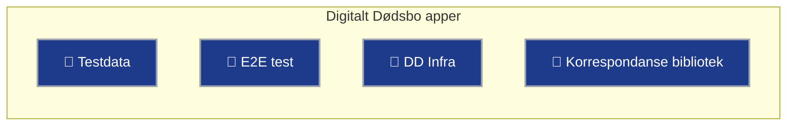

# oed
Oppgjør etter dødsfall

Blå betyr at Digitalt Dødsbo teamet er ansvarlig for tjenesten.

```mermaid
flowchart TB
    %% 👤 User
    User@{ img: "https://raw.githubusercontent.com/FortAwesome/Font-Awesome/refs/heads/7.x/svgs/regular/user.svg", pos: "b", label: "Bruker", w: 60, h: 60, constraint: "on" }

    %% 🟥 Domstol administrasjonen
    subgraph DA [Domstol administrasjonen]
        DAFeed[Hendelseslista]
        DA_Node[Domstol Administrasjonen]
    end

    %% 🟦 Altinn 3
    subgraph Altinn3 [Altinn 3]
        A3Authz[🔗 Altinn Autorisasjon]
        A3Events[🔗 Altinn 3 Event systemet]
        Inbox[Innboks]
        AltinnMsg[Altinn Melding]
        Estate[🔗 Oppgjør etter dødsfall]
        Declaration[🔗 Skifteerklæring]
        DDEvents[🔗 oed-events]

        A3Events --> DA_Node
    end

    %% 🟦 Altinn 2
    subgraph Altinn2 [Altinn 2]
        A2Correspondance[Altinn 2 Korrespondanse]
    end

    %% 🟨 Digitalt Dødsbo
    subgraph DD[Digitalt Dødsbo]
        AdminApp[🔗 Admin]-->MetaDb
        MetaDb[(Metadata database)]
        DD3Authz[🔗 DD Authz]
        TaskQ[(TaskQueue)]
        Feedpoller[🔗 Feedpoller og proxy]
    end

    %% 🔁 Flow
    User -- Logger inn --> A3Authz --> Inbox --> AltinnMsg --> Estate
    Estate --> TaskQ

    Estate -- Autoriserer bruker --> A3Authz
    A3Authz -- Henter roller --> DD3Authz
    Estate --> Declaration -- Publiser sent-event --> A3Events
    DA_Node -- Henter skifteerklæring --> Estate

    Feedpoller -- Poll hvert 5. minutt --> DDEvents
    DDEvents -- Henter hendelsesliste --> DAFeed
    DDEvents -- Publiser CloudEvents --> A3Events
    A3Events <--> Estate --> MetaDb
    TaskQ -- Send korrespondanse --> A2Correspondance --> User

    %% 🔗 Clickable links
    click Estate "https://altinn.studio/repos/digdir/oed" "Gå til Gitea - Digitalt Dødsbo" _blank
    click Declaration "https://altinn.studio/repos/digdir/oed-declaration" "Gå til Gitea - Skifteerklæring" _blank
    click DD3Authz "https://github.com/Altinn/oed-authz" "Gå til Github - A3Authz" _blank
    click DDEvents "https://altinn.studio/repos/digdir/oed-events" "Gå til Gitea - Events" _blank
    click Feedpoller "https://github.com/Altinn/oed-feedpoller" "Gå til Github - Feedpoller" _blank
    click A3Authz "https://github.com/Altinn/altinn-authorization" "Gå til Github - Altinn autorisasjon" _blank
    click A3Events "https://github.com/Altinn/altinn-events" "Gå til Github - Altinn Events" _blank
    click AdminApp "https://github.com/Altinn/oed-admin" "Gå til Github - Admin" _blank

    %% 🎨 Styles
    classDef altinn3 fill:#4b5563,stroke:#60a5fa,stroke-width:2px,color:#fff;
    classDef dd fill:#1e3a8a,stroke:#9ca3af,stroke-width:2px,color:#fff;
    classDef da fill:#7f1d1d,stroke:#f87171,stroke-width:2px,color:#fff;
    classDef arkiv fill:#065f46,stroke:#34d399,stroke-width:2px,color:#fff;
    classDef user fill:#fff

    class Altinn,Inbox,A3Events,A3Authz,AltinnMsg,A2Correspondance altinn3
    class Estate,TaskQ,Declaration,DDEvents,Feedpoller,DD3Authz,AdminApp,MetaDb dd
    class DA_Node,DAFeed da
    class ArchiveSystem arkiv
    class User user
```
