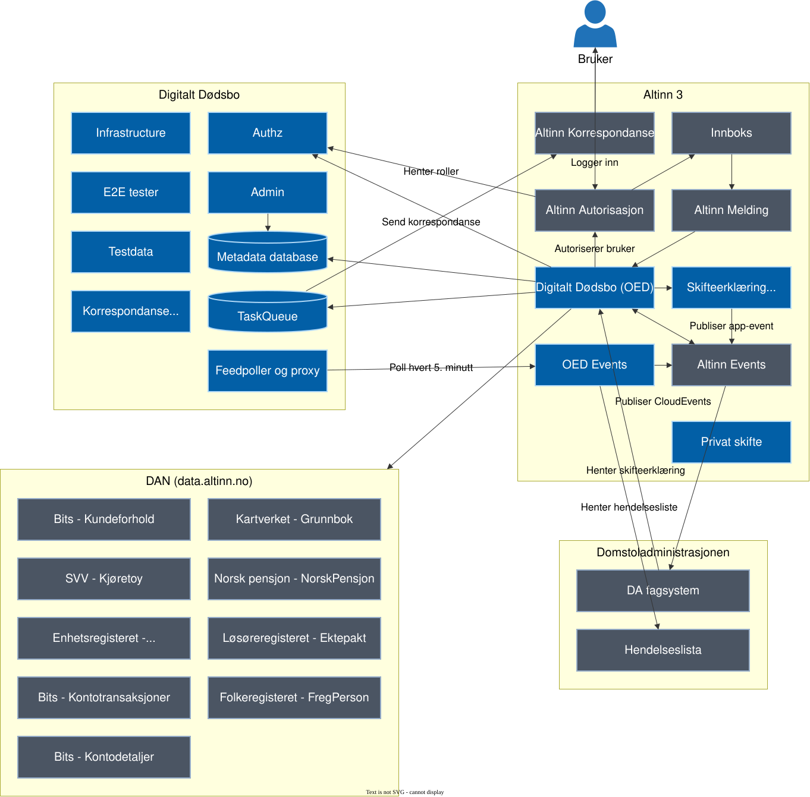

# Digitalt Dødsbo

Lyseblå betyr at Digitalt Dødsbo-teamet er ansvarlig for tjenesten.

<picture>
  <source media="(prefers-color-scheme: dark)" srcset="docs/oed-dark.svg">
  <source media="(prefers-color-scheme: light)" srcset="docs/oed-light.svg">
  
</picture>

## Komponenter

### Digitalt Dødsbo

- [Infrastructure](https://github.com/Altinn/dd-infrastructure/)
- [E2E tester](https://github.com/altinn/dd-e2e-test/)
- [Testdata](https://github.com/Altinn/oed-testdata-app)
- [Korrespondanse bibliotek](https://github.com/Altinn/oed-messaging)
- [Authz](https://github.com/Altinn/oed-authz)
- [Admin](https://github.com/Altinn/oed-admin)
- [Feedpoller og proxy](https://github.com/Altinn/oed-feedpoller)

### Altinn 3

- [Altinn Autorisasjon](https://github.com/Altinn/altinn-authorization)
- [Altinn Events](https://github.com/Altinn/altinn-events)
- [Digitalt Dødsbo (OED)](https://altinn.studio/repos/digdir/oed)
- [OED Events](https://altinn.studio/repos/digdir/oed-events)
- [Skifteerklæring (legacy)](https://altinn.studio/repos/digdir/oed-declaration)
- [Privat skifte](https://altinn.studio/repos/digdir/dd-private-probate)

### DAN (data.altinn.no)

- [Bits - Kundeforhold](https://github.com/data-altinn-no/plugin-banking/blob/main/src/Altinn.Dan.Plugin.Banking/Plugin.cs#L61)
- [Bits - Kontotransaksjoner](https://github.com/data-altinn-no/plugin-banking/blob/main/src/Altinn.Dan.Plugin.Banking/Plugin.cs#L70)
- [Bits - Kontodetaljer](https://github.com/data-altinn-no/plugin-banking/blob/main/src/Altinn.Dan.Plugin.Banking/Plugin.cs#L79)
- [SVV - Kjøretoy](https://github.com/data-altinn-no/plugin-statensvegvesen)
- [Enhetsregisteret - Virksomhetsinformasjon](https://github.com/data-altinn-no/plugin-brreg/blob/main/src/Dan.Plugin.Brreg/UnitBasicInformation.cs#L83)
- [Kartverket - Grunnbok](https://github.com/data-altinn-no/plugin-kartverket)
- [Norsk pensjon - NorskPensjon](https://github.com/data-altinn-no/plugin-pensjon)
- [Løsøreregisteret - Ektepakt](https://github.com/data-altinn-no/plugin-brreg/blob/main/src/Dan.Plugin.Brreg/Ektepakt.cs#L66)
- [Folkeregisteret - FregPerson](https://github.com/data-altinn-no/plugin-skatteetaten/blob/main/src/Dan.Plugin.Skatteetaten/Freg.cs#L97)
